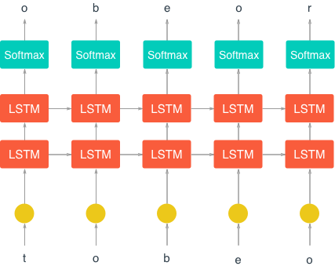

# Text Generation with RNN


## Overview

In this notebook, I'll construct a character-level LSTM with PyTorch. The network will train character by character on some text, then generate new text character by character. As an example, I will train on Anna Karenina. **This model will be able to generate new text based on the text from the book!**


## Result

Here is a text that the model generated:

```
Anna
Paidona and his brother, trying in so suddenly to him.

"If's it's their feeling,
but you know!" asked Levin.

Stepan Arkadyevitch was not askaded a minute all thrae moments and horror,"
she added; "taking others and that yards is in the
mind in the cherist crambled services and and conversation that to be for her..."

"Oh, no! I have no one and soon. I was in the simple."

"I do believe your way, and what dressed to have such a profit of anything for me,
but then you was angry at the begt of it. I'm going to the class too," said Anna.

"Yes, that is this, it was settled. We'll
be sorry to see him with having a most bearfal and the people, and I should not
be found about her."

After
trustly was not all the dream of the present of the child, and she did not come on him.

"Well the priest is in the moment and the perices of the position in to such the husband, but I want to be in marriage."

He was at heart as had struck her fach, which was
anyone to be the same to take
their
chorite. H
```

Code is in the file `Character_Level_RNN_Solution.ipynb`
Programmed using Jupyter Notebook

## Reflection

### Network Architecture



1. Input layer

2. Hidden Layer x2

3. Softmax function, which gives us a probability distribution that we can then sample to predict the next character.

### Defining the Network by PyTorch

```
class CharRNN(nn.Module):
    def __init__(self, tokens, n_hidden=256, n_layers=2,
                               drop_prob=0.5, lr=0.001):
        super().__init__()
        self.drop_prob = drop_prob
        self.n_layers = n_layers
        self.n_hidden = n_hidden
        self.lr = lr
        
        # creating character dictionaries
        self.chars = tokens
        self.int2char = dict(enumerate(self.chars))
        self.char2int = {ch: ii for ii, ch in self.int2char.items()}
        
        ## TODO: define the LSTM
        self.lstm = nn.LSTM(len(self.chars), n_hidden, n_layers, 
                            dropout=drop_prob, batch_first=True)
        
        ## TODO: define a dropout layer
        self.dropout = nn.Dropout(drop_prob)
        
        ## TODO: define the final, fully-connected output layer
        self.fc = nn.Linear(n_hidden, len(self.chars))

    def forward(self, x, hidden):
        ''' Forward pass through the network. 
            These inputs are x, and the hidden/cell state `hidden`. '''
                
        ## TODO: Get the outputs and the new hidden state from the lstm
        r_output, hidden = self.lstm(x, hidden)
        
        ## TODO: pass through a dropout layer
        out = self.dropout(r_output)
        
        # Stack up LSTM outputs using view
        # you may need to use contiguous to reshape the output
        out = out.contiguous().view(-1, self.n_hidden)
        
        ## TODO: put x through the fully-connected layer
        out = self.fc(out)
        
        # return the final output and the hidden state
        return out, hidden
```

### Hyperparameters

Here are the hyperparameters for the network.

In defining the model:

- `n_hidden` - The number of units in the hidden layers.
  - In this case `n_hidden=512`
- `n_layers` - Number of hidden LSTM layers to use.
  - In this case `n_layers=2`

We assume that dropout probability and learning rate will be kept at the default, in this example.

And in training:

- `batch_size` - Number of sequences running through the network in one pass.
  - In this case `batch_size=128`
- `seq_length` - Number of characters in the sequence the network is trained on. Larger is better typically, the network will learn more long range dependencies. But it takes longer to train. 100 is typically a good number here.
  - In this case `seq_length=100`
- `n_epochs` - Number of epochs
  - In this case `n_epochs=20`
- `lr` - Learning rate for training
  - In this case (for most neural networks) `lr=0.001`